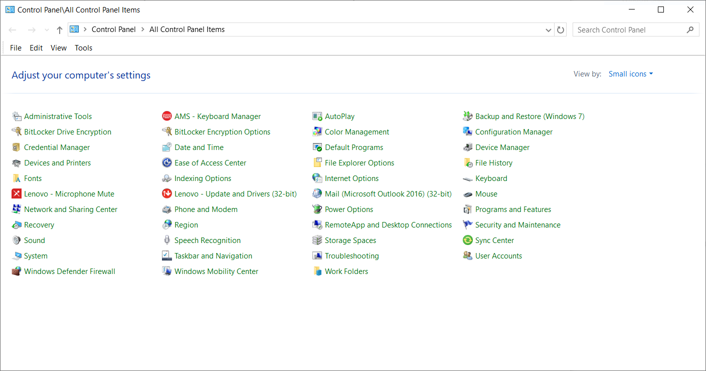
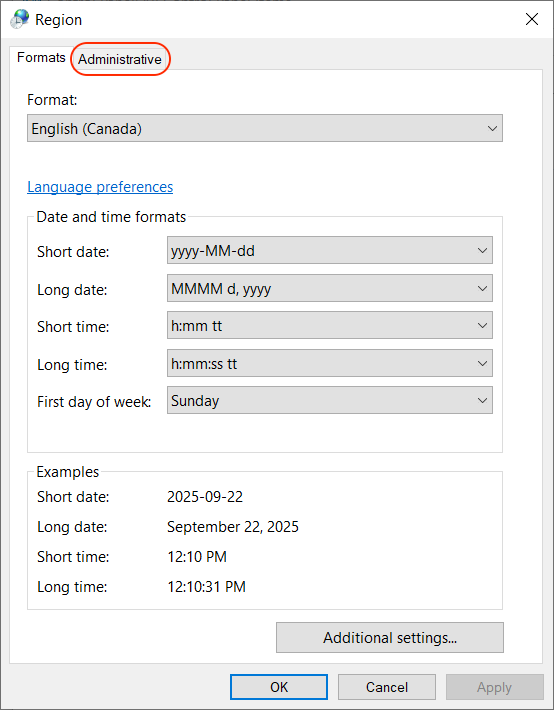
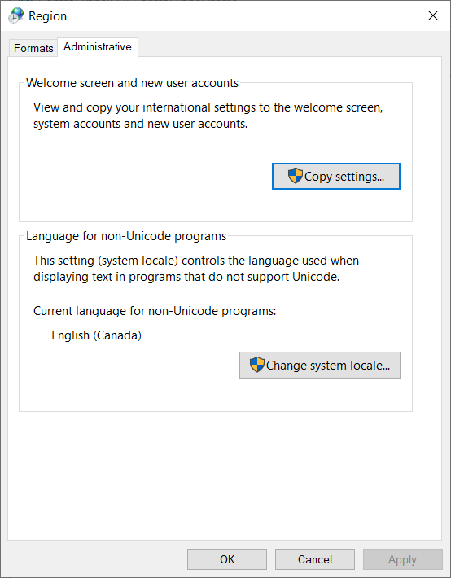
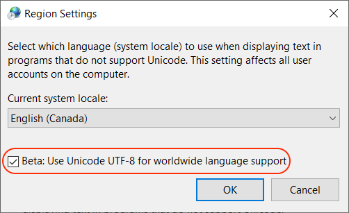

# INSTALLING DIMROOM

## Installation (Using CMAKE)

Installing and running this package requires:

* a C++ compiler;
* the [Git](https://git-scm.com/downloads) version control system; and
* the [CMake](https://cmake.org/download/) build tool.

Dimroom was originally built and tested on a Mac Studio (MacOS 15.5), using the Clang 17.0.0
C++ compiler and VSCode. It does compile without error in that environment.

It has also been tested on 64-bit Windows, using version 19.44.35214 of the Microsoft C++
compiler for VSCode.

It also builds and runs on a Samsung Galaxy Tab S9 Android tablet running
Linux 5.15.178-android13-8, but that is not covered in this document.

### Obtaining the Source Code

The source code is available on GitHub.

#### Mac OS

Clone `git@github.com:jbtubman/dimroom.git` into a directory.

    $ cd ~/src
    $ git clone git@github.com:jbtubman/dimroom.git
    $ cd dimroom

#### Windows

The instructions for Windows must be done in a command window.

Clone `git@github.com:jbtubman/dimroom.git` into a folder.

    C:\Users\asmithee\src> git clone git@github.com:jbtubman/dimroom.git
    C:\Users\asmithee\src> cd dimroom

### Building and Running On Mac OS

In the `dimroom` directory, create a `build` directory and go into it:

    $ mkdir build
    $ cd build

Create the `Makefile` by running CMake thusly:

    $ cmake ..

This will create the file `build\Makefile`. Then type

    $ make

This will build the executable file `dimroom` in the `build` directory
and the executable file `test_dimroom` in the `build/test` directory.

`dimroom` uses [Google Test](https://google.github.io/googletest/) as its testing library.
To run the tests, in the `dimroom/build` directory, enter the command:

    $ test/test_dimroom

The tests can also be run in the testing tool in VS Code.

To run `dimroom`, in the `dimroom/build` directory, enter the command:

    $ ./dimroom ../test/data/sample.csv

### Building and Running On Windows

In the `dimroom` folder, create a `build` folder and go into it:

    C:\Users\asmithee\src\dimroom> mkdir build
    C:\Users\asmithee\src\dimroom> cd build

Create the VS Code solution by running CMake thusly:

    C:\Users\asmithee\src\dimroom\build> cmake ..

This will detect the compiler and create the `dimroom.sln` file.

To build the executables, enter the following command:

    C:\Users\asmithee\src\dimroom\build> cmake --build . --config Debug

This will build the execuable file `dimroom.exe` in the `build\Debug` folder
and the executable file `test_dimroom.exe` in the `build\test\Debug` folder.
(You can also use `Release` instead of `Debug` if desired.)

`dimroom` uses [Google Test](https://google.github.io/googletest/) as its testing library.
To run the tests, in the `dimroom\build` folder, enter the command:

    C:\Users\asmithee\src\dimroom\build> .\test\Debug\test_dimroom.exe

The tests can also be run in the testing tool in VS Code.

#### Configuring Windows For the UTF-8 Character Encoding

`dimroom` is designed to work in a command-line terminal, with the UTF-8 character
encoding system. By default, Windows is configured to use UTF-16 character encoding.
It is necessary to make some changes to properly display UTF-8 characters.

Begin by opening the Windows Control Panel. Click on `Region` (circled in red below).

When the Region dialog comes up, click on the `Administrative` tab (circled in red below).

On the `Administrative` tab, click on the `Change system locale...` button (circled in
red below).

In the `Region Settings` dialog, make sure that `Beta: Use Unicode UTF-8 for
worldwide language support` is checked (circled in red below).

Close the dialogs by clicking the `OK` button, and restart Windows. The machine
will now correctly display UTF-8 text in command-line windows.

#### Running Dimroom

To run `dimroom`, enter the command:

    C:\Users\asmithee\src\dimroom\build> .\Debug\dimroom.exe ..\test\data\sample.csv
